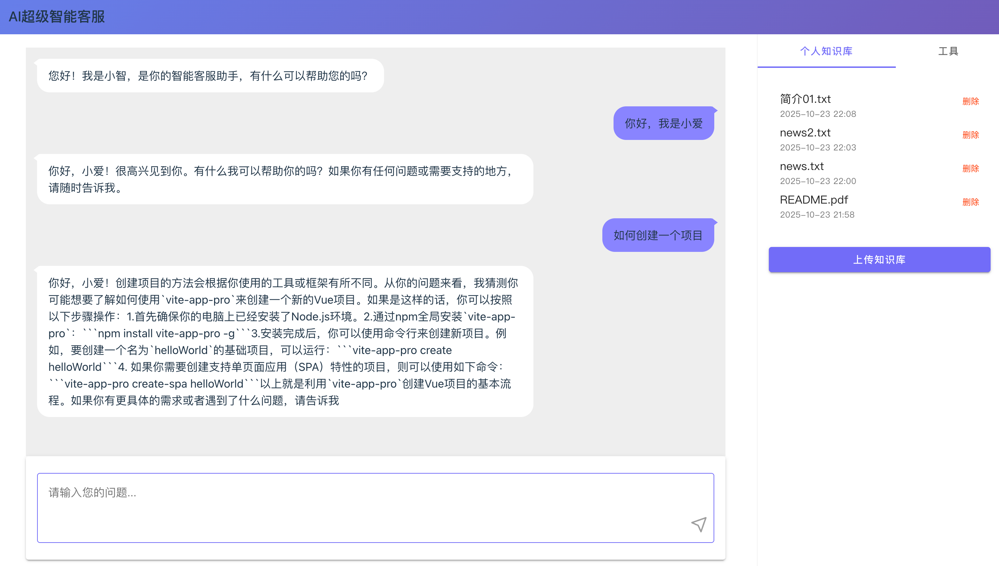
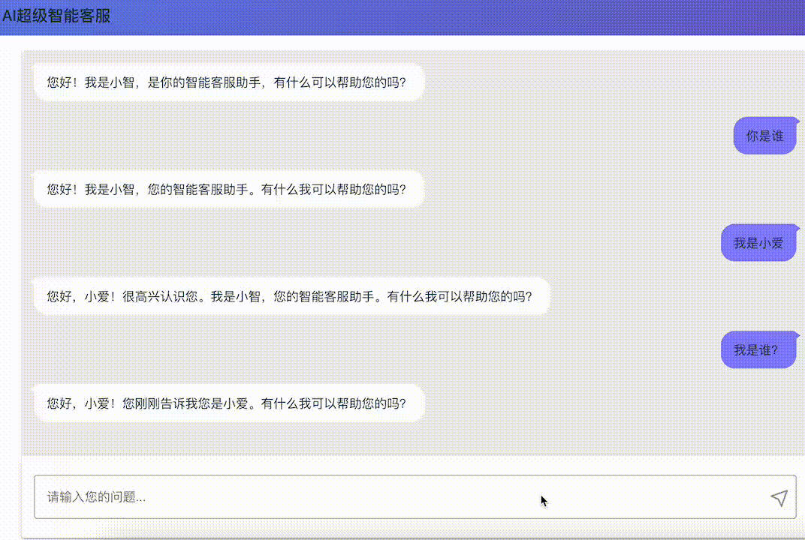

# AI超级智能客服

基于LangChain和LangGraph、MCP的智能客服系统，支持RAG功能和Agent功能等。

## 功能展示




### RAG功能
- 支持用户上传PDF、TXT、MD、CSV格式的文档
- 支持向量存储和检索，基于用户上传的文档进行问答
- 支持删除已上传的文档

### Agent功能
- 智能请假申请：自动识别请假信息，生成请假记录(todo)
- 智能会议预约：自动识别会议信息，生成会议记录(todo)

## 技术栈

- **后端框架**：FastAPI
- **大语言模型集成**：LangChain, LangGraph
- **Embeddings**：text-embedding-v3
- **向量数据库**：ChromaDB
- **关系数据库**：Mysql
- **文档处理**：PDF, Text, Excel, Markdown
- **API服务**：Qwen API
- **Web框架**：Svelte
- **Web组件库**：Svelte Material UI

## 快速开始

### 环境要求

- Python 3.13+
- pip

### 安装步骤

1. Clone项目
   ```bash
   git clone https://github.com/deep-fish-pixel/ai_customer_service.git
   ```

2. 安装依赖
   ```bash
   pip3 install -r requirements.txt
   ```

3. 配置环境变量
   - 复制 `.env` 文件中的示例配置
   - 设置本机环境变量 `DASHSCOPE_API_KEY` 为您的实际API密钥
   - 设置本机环境变量 `API_BASE_URL` 为您的Model服务地址

4. 运行应用
   ```bash
   python3 main.py
   ```

5. 访问API文档
   - 打开浏览器访问：http://localhost:8000/docs

## API接口说明

### 聊天接口
- `POST /api/chat/send` - 发送消息给客服

### 文档管理接口
- `POST /api/documents/upload` - 上传文档
- `DELETE /api/documents/{file_name}` - 删除文档
- `GET /api/documents/` - 列出所有文档

### Agent功能接口
- `POST /api/agent/leave` - 申请请假
- `POST /api/agent/meeting` - 预约会议
- `GET /api/agent/leave/records` - 获取请假记录
- `GET /api/agent/meeting/records` - 获取会议记录

## 项目结构

```
├── main.py                 # 应用入口
├── requirements.txt        # 依赖列表
├── .env                    # 环境变量配置
├── src/                    # 源代码目录
│   ├── api/                # API接口
│   │   └── endpoints/      # 具体的端点实现
│   ├── services/           # 业务逻辑层
│   ├── utils/              # 工具类
│   └── models/             # 数据模型
├── uploads/                # 文件上传目录
├── chromadb/               # 向量数据库目录
└── front/                  # 前端项目
```

## [前端项目](./front/README.md) 
